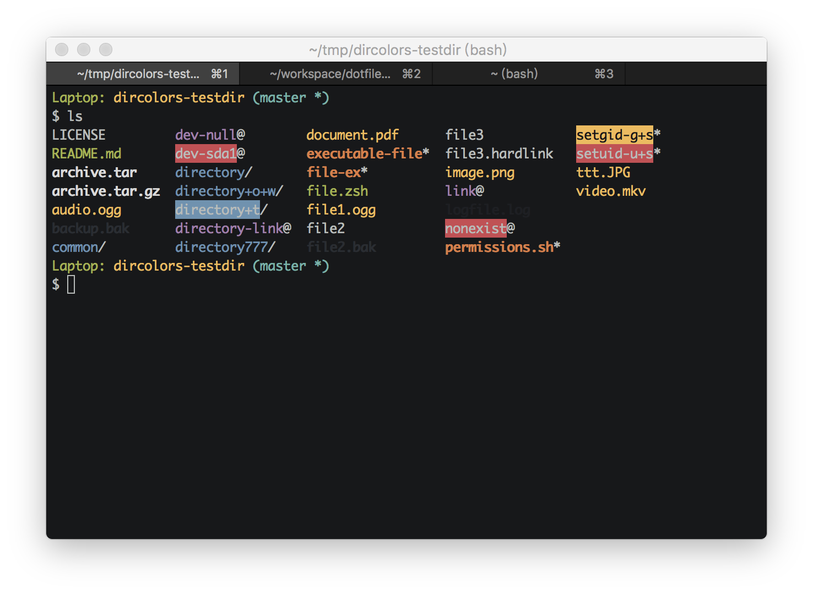

## dotfiles

**under refactoring**

yet a simple, uniform terminal style, for macOS, Windows, and Linux.

### iTerm2 (macOS)

### Git Bash Mintty (Windows)

### Powershell with [Scoop](https://github.com/lukesampson/scoop) on [Cmder](https://github.com/cmderdev/cmder) (Windows)

