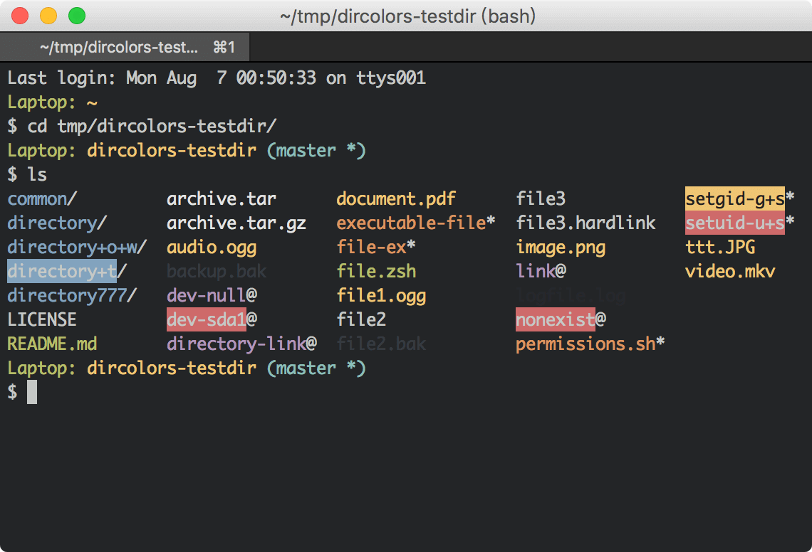
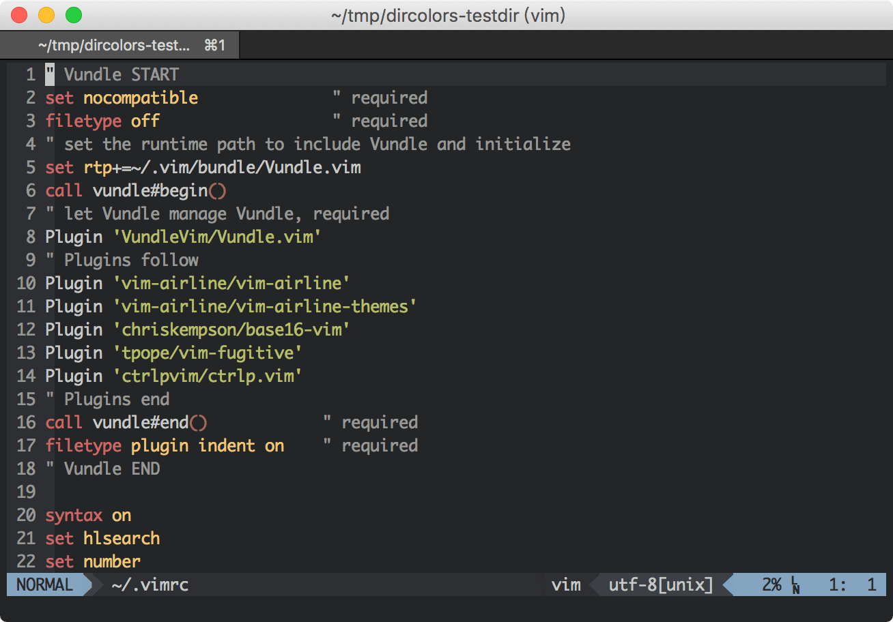
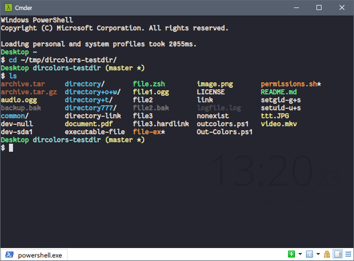
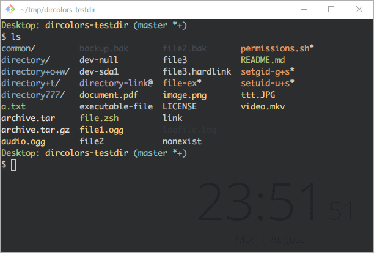
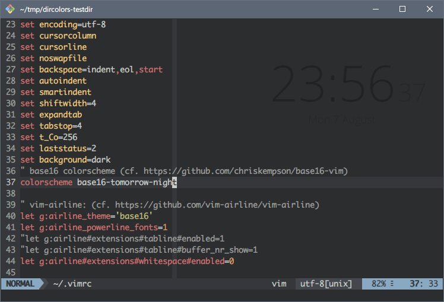
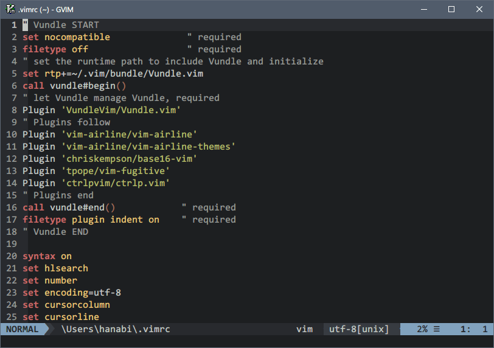
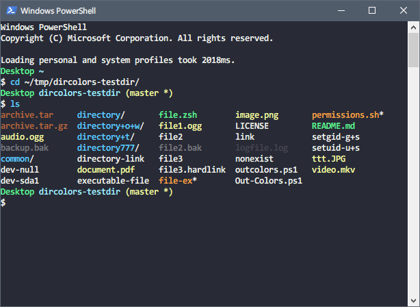
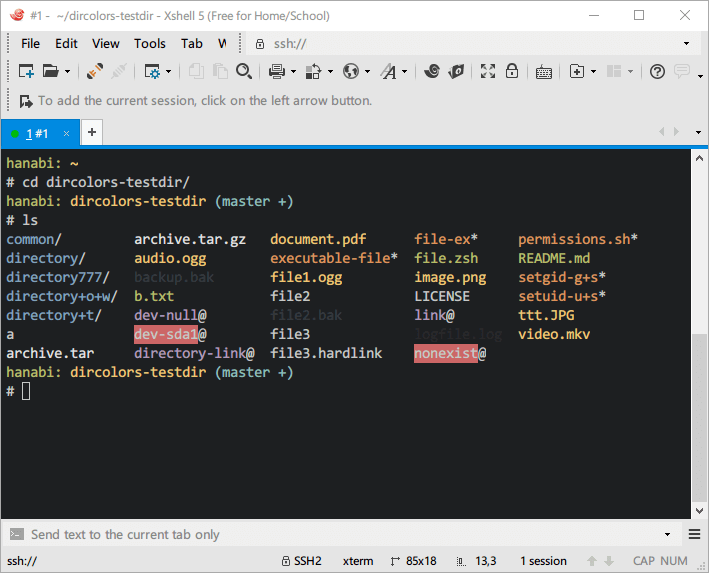

<h1 align="center">Spotlight</h1>

  Click to view the full-size screenshots.

<h2 align="center">macOS</h2>

  
   
  ↑ macOS, iTerm2

  
   
  ↑ macOS, iTerm2, Vim

 

<h2 align="center">Windows</h2>

  
   
  ↑ Windows, Cmder, Powershell

  
   
  ↑ Windows, Git Bash

  
   
  ↑ Windows, Git Bash, Vim

  
   
  ↑ Windows, GVim

  
   
  ↑ Windows, Powershell

  
   
  ↑ Windows, Xshell

